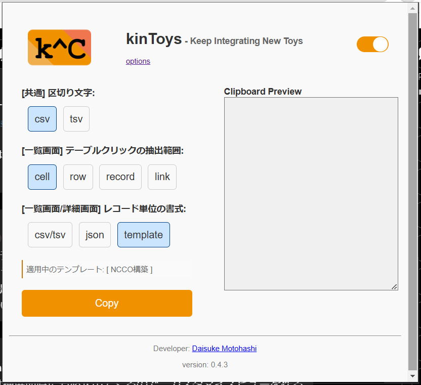
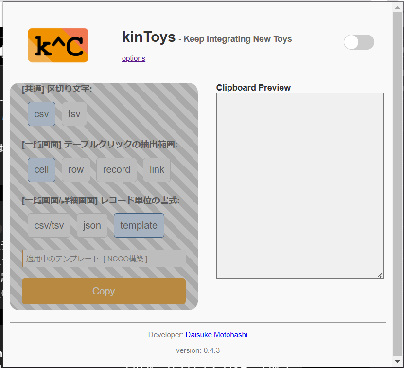

# 主な使い方

This page demonstrates some of the built-in markdown extensions provided by VitePress.

## Quick Copy

特定の情報を素早く取得したい場合に便利です。

kintoneの画面上で表のセルをクリックすることで、セル単体や行全体、またはレコード全体をクリップボードにコピーします。

コピー対象はポップアップウィンドウのラジオボタンであらかじめ選択しておきます。

## Grab Copy

画面上のデータを一括して取得したいときに適しています。

拡張機能アイコンをクリックしてポップアップウィンドウを開いて「Copy」ボタンから実行します。

画面上の表全体や詳細画面に表示されているレコード全体の情報を一気にコピーすることができます。

## 無効モード

一時的に機能を停止させることができます。

ポップアップの右上に表示されているラジオボタンから切り替えてください。

無効化状態では、下のスクリーンショットのようにラジオボタンに網掛けが入ります。

